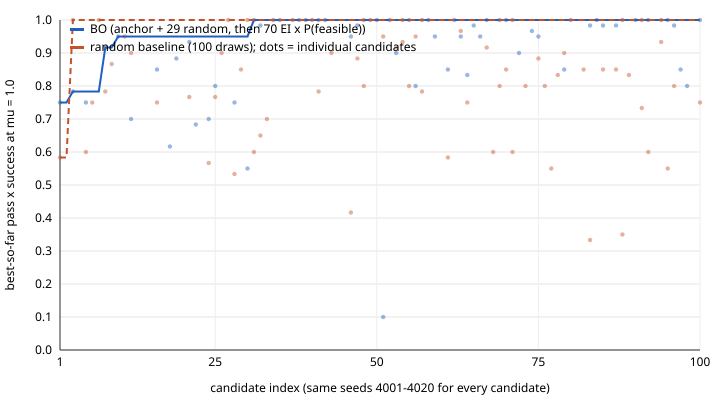

# Bayesian morphology optimization (Part B): campaign report

Generated 2026-09-18 20:11:01. Objective = pass x success at mu = 1.0 from `tools/bo_eval.evaluate` on 20 episodes, seeds 4001-4020, sampled action head (deployment behaviour), one player build for everything below.

- Player build sha256 `ff457d2c6b88329c3fe53037d72938bce8fe482feff992cea1f669d2c166d9f8` (196 files under `Builds/BoEval/`, recorded 2026-09-18 19:29:00); the drift checks below confirm it did not change.
- Wall time: 39.1 min in player runs (sum over evaluations); campaign process 42.0 min including model fits.
- Candidates: BO arm 100 (reference anchor + 29 random, then 70 BO iterations), random baseline 100; confirmation runs 10; drift checks 5.

## Drift control

| check | after objective evaluations | episodes.csv identical | drops.csv identical | objective |
|---|---|---|---|---|
| 1 | 25 | True | True | 0.750 |
| 2 | 50 | True | True | 0.750 |
| 3 | 75 | True | True | 0.750 |
| 4 | 100 | True | True | 0.750 |
| 5 | 125 | True | True | 0.750 |

Anchor (reference theta, BO #1): objective 0.750, success 20/20, pass given hold 0.750, palm contact 0.00.

## Best-so-far, BO vs random baseline (optimization block: selection-biased)

`best_so_far.csv`, `candidates.csv`. Numbers in this section are 20-episode estimates on the seeds used for selection and are biased upward for the winners; the confirmation section carries the headline numbers.

| arm | candidates with an objective | best | mean | median | >= anchor |
|---|---|---|---|---|---|
| BO | 68 | 1.000 | 0.913 | 0.983 | 62 |
| random | 58 | 1.000 | 0.774 | 0.800 | 41 |

best-so-far after 30 candidates: BO 0.950, random 1.000

best-so-far after 50 candidates: BO 1.000, random 1.000

best-so-far after 75 candidates: BO 1.000, random 1.000

best-so-far after 100 candidates: BO 1.000, random 1.000

## Confirmation (headline numbers): top 5 of each arm on seeds 4021-4100, 80 fresh episodes, mu 0.6 / 1.0 / 1.5

Selection used seeds 4001-4020 only; these seeds were never used for selection.

| arm | rank | cand. | theta | opt-block score (biased) | **confirmation pass x success, mu 1.0 [95% CI]** | conf. mu 0.6 / 1.5 | conf. success | conf. pass given hold mu 1.0 | palm contact | contacts | oracle (gate step / contacts / push-out) |
|---|---|---|---|---|---|---|---|---|---|---|---|
| bo | 1 | #31 | scales mean 1.017 (min 0.86, max 1.20, thumb 0.86); 11 active, mask 10111100111111; active-group omega 29.5 (min 13.6), zeta 0.72, I-scale 1.35; wrist omega 14.6 | 1.000 | **1.000 [1.000, 1.000]** | 0.996 / 1.000 | 80/80 | 1.000 | 0.01 | 7.6 | 128 / 6 / 16 mm |
| bo | 2 | #34 | scales mean 1.016 (min 0.83, max 1.20, thumb 0.87); 10 active, mask 10111100110111; active-group omega 28.5 (min 13.3), zeta 0.71, I-scale 1.32; wrist omega 13.3 | 1.000 | **0.992 [0.975, 1.000]** | 0.963 / 1.000 | 80/80 | 0.992 | 0.00 | 7.6 | 128 / 6 / 16 mm |
| bo | 3 | #35 | scales mean 1.007 (min 0.80, max 1.20, thumb 0.84); 10 active, mask 10011100111111; active-group omega 29.3 (min 13.4), zeta 0.76, I-scale 1.37; wrist omega 12.9 | 1.000 | **0.988 [0.963, 1.000]** | 0.975 / 0.988 | 79/80 | 1.000 | 0.01 | 7.3 | 128 / 6 / 18 mm |
| bo | 4 | #37 | scales mean 1.003 (min 0.80, max 1.20, thumb 0.83); 10 active, mask 10011101110111; active-group omega 26.8 (min 13.6), zeta 0.74, I-scale 1.28; wrist omega 12.3 | 1.000 | **1.000 [1.000, 1.000]** | 1.000 / 1.000 | 80/80 | 1.000 | 0.00 | 7.5 | 125 / 7 / 19 mm |
| bo | 5 | #38 | scales mean 1.017 (min 0.80, max 1.20, thumb 0.84); 10 active, mask 10111000111111; active-group omega 29.5 (min 16.9), zeta 0.71, I-scale 1.29; wrist omega 11.7 | 1.000 | **0.988 [0.963, 1.000]** | 0.963 / 0.988 | 80/80 | 0.988 | 0.00 | 7.0 | 67 / 6 / 17 mm |
| random | 1 | #3 | scales mean 1.016 (min 0.82, max 1.14, thumb 1.00); 10 active, mask 11111100110011; active-group omega 26.1 (min 16.4), zeta 0.62, I-scale 1.23; wrist omega 21.3 | 1.000 | **1.000 [1.000, 1.000]** | 1.000 / 1.000 | 80/80 | 1.000 | 0.00 | 8.2 | 130 / 7 / 11 mm |
| random | 2 | #7 | scales mean 1.039 (min 0.87, max 1.16, thumb 1.05); 12 active, mask 01111101111111; active-group omega 23.6 (min 12.7), zeta 0.66, I-scale 1.61; wrist omega 12.9 | 1.000 | **0.938 [0.875, 0.988]** | 0.883 / 0.938 | 80/80 | 0.938 | 0.00 | 7.6 | 128 / 6 / 6 mm |
| random | 3 | #27 | scales mean 1.017 (min 0.84, max 1.20, thumb 0.91); 12 active, mask 11111001111111; active-group omega 28.0 (min 13.4), zeta 0.59, I-scale 1.15; wrist omega 22.5 | 1.000 | **0.979 [0.946, 1.000]** | 0.958 / 0.988 | 80/80 | 0.979 | 0.00 | 7.7 | 147 / 6 / 14 mm |
| random | 4 | #30 | scales mean 1.112 (min 1.03, max 1.16, thumb 1.10); 11 active, mask 11101011111101; active-group omega 23.3 (min 14.6), zeta 0.59, I-scale 1.16; wrist omega 20.3 | 1.000 | **0.921 [0.858, 0.975]** | 0.858 / 0.963 | 80/80 | 0.921 | 0.00 | 7.4 | 134 / 7 / 19 mm |
| random | 5 | #63 | scales mean 1.091 (min 0.93, max 1.20, thumb 0.98); 12 active, mask 11111100111111; active-group omega 22.7 (min 12.5), zeta 0.57, I-scale 1.37; wrist omega 22.6 | 0.967 | **0.988 [0.963, 1.000]** | 0.942 / 1.000 | 80/80 | 0.988 | 0.00 | 9.3 | 127 / 7 / 1 mm |

## Oracle feasibility

- BO arm: 68/100 feasible (0.68).
- random arm: 58/100 feasible (0.58).
- all: 126/200 feasible (0.63).

| group | n | mean active groups | thumb groups active (mean) | mean scale | thumb scale | index scale | active-group omega | oracle max contacts |
|---|---|---|---|---|---|---|---|---|
| feasible | 126 | 10.94 | 1.88 | 1.007 | 0.928 | 0.942 | 26.9 | 6.6 |
| infeasible | 74 | 9.99 | 1.45 | 0.986 | 0.978 | 0.958 | 26.2 | 4.4 |

Feasibility rate by active-group count: 7: 2/3, 8: 9/20, 9: 12/26, 10: 29/51, 11: 24/40, 12: 25/33, 13: 19/21, 14: 6/6
Groups most often masked among infeasible candidates: ringBase (36/74), thumbBase (30/74), indexMiddle (28/74), pinkyBase (26/74), indexBase (25/74)

## Patterns in the evaluated candidates (descriptive)

| group | n | objective | mean scale | thumb scale | index scale | active groups | active-group omega | zeta | I-scale | palm contact | contacts |
|---|---|---|---|---|---|---|---|---|---|---|---|
| top 10 (both arms, opt block) | 10 | 1.000 | 1.011 | 0.847 | 0.811 | 9.80 | 28.4 | 0.72 | 1.30 | 0.00 | 7.12 |
| bottom 10 | 10 | 0.453 | 1.005 | 0.999 | 0.967 | 10.70 | 26.1 | 0.67 | 1.22 | 0.01 | 6.89 |
| all with an objective | 126 | 0.849 | 1.007 | 0.928 | 0.942 | 10.94 | 26.9 | 0.67 | 1.26 | 0.00 | 7.42 |

Final GP hyperparameters (normalized [0, 1] units per block; a small lengthscale means the objective varies quickly along that block): lengthScale 3.24, omega 7.11, zeta 7.27, inertiaScale 6.99, mask 2.40 (Hamming units), outputscale 1.41, noise 0.023 (standardized).

BO proposals came from the local pool (perturbations of the top-5 incumbents) in 58/70 iterations, from the global pool otherwise; mean P(feasible) of the proposals 0.82.

## Observations (descriptive; patterns only)

The 20-episode objective saturates: 31 of the 68 feasible BO candidates and 4 of the 58 feasible random candidates score
20/20 on seeds 4001-4020, the first BO proposal (#31) already sits at the ceiling and the random arm reaches it at draw #3,
so the best-so-far curves coincide from candidate 31 on and the optimization block cannot rank the top candidates; the
arms separate in the bulk instead (BO-iteration mean 0.953 over 53 feasible proposals versus 0.776 for the 29 random
initial draws and 0.774 for the random arm; 62/68 BO candidates at or above the anchor's 0.750 versus 41/58 random) and in
the confirmation block (BO top 5: 0.988-1.000 at mu 1.0, mean 0.993; random top 5: 0.921-1.000, mean 0.965; at mu 0.6
0.979 versus 0.928). Both arms contain a candidate that confirms at 1.000 on all 80 fresh episodes (BO #31 and #37,
random #3), and every confirmed candidate keeps success at 79-80/80, so the confirmation differences are drop-test
differences, not grasp failures. The BO top 5 are one family rather than five designs: pairwise normalized distances
0.3-0.7 with Hamming distances 1-4 (random top 5: 2.7-3.5 and 2-7), 58 of the 70 BO proposals came from the local pool,
and all five share indexMiddle and ringBase masked, index scale 0.80-0.86 and thumb scale 0.83-0.87 with the middle,
ring and pinky scales at 1.05-1.20, active-group omega 27-30 rad/s, zeta 0.71-0.76, wrist omega 12-15 rad/s. The random
top 5 have thumb scales 0.91-1.10 and wrist omega 13-23, so the short-thumb / short-index pattern is where the optimizer
converged, not a property shared by all high scorers; within the random arm alone the objective is flat in thumb scale
(0.77 / 0.75 / 0.82 for < 0.9 / 0.9-1.1 / >= 1.1) and rises mildly with active-group count (0.69 at 10 to 0.82 at 13).
The GP's block lengthscales rank the link scales (3.2) and the mask (2.4 Hamming) as the directions along which the
objective varies fastest and omega / zeta / inertia (about 7) as nearly flat. Palm contact stays at zero for every
candidate in both arms (maximum 0.05 in the optimization block, 0.01 in confirmation): the pinch grip of run 010 is
unchanged across the explored morphologies, including the short-fingered winners. Oracle infeasibility (37 % overall)
concentrates in candidates with fewer active groups (10.0 versus 10.9), fewer active thumb groups (1.45 versus 1.88) and
with ringBase, thumbBase or indexMiddle masked; feasibility rises from about half at 8-10 active groups to 90 % at 13 and
100 % at 14.

